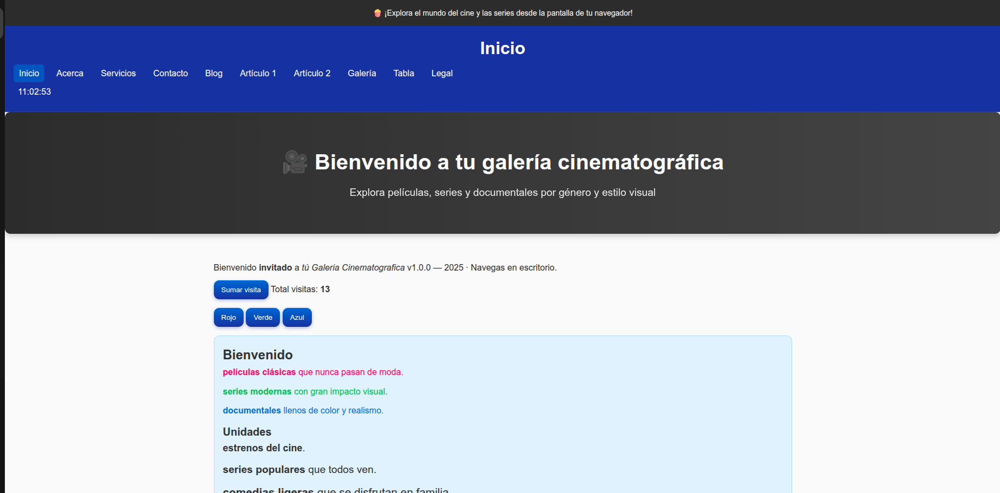
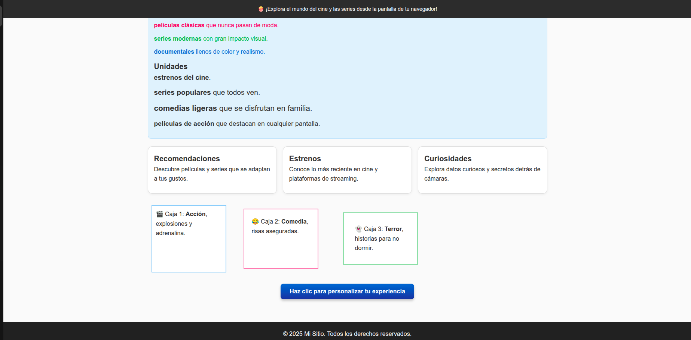
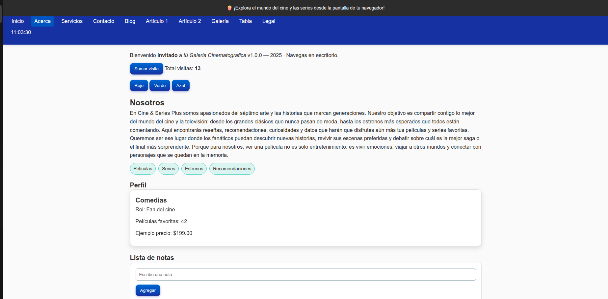
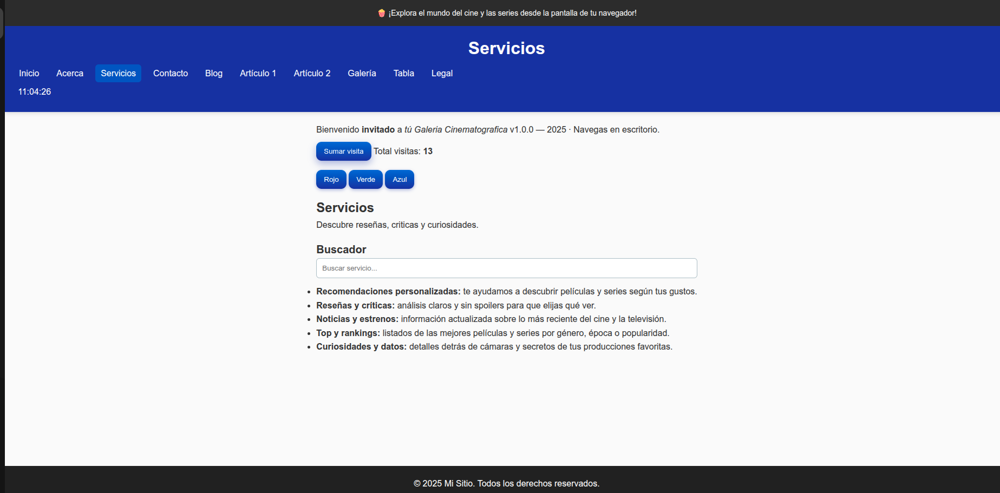
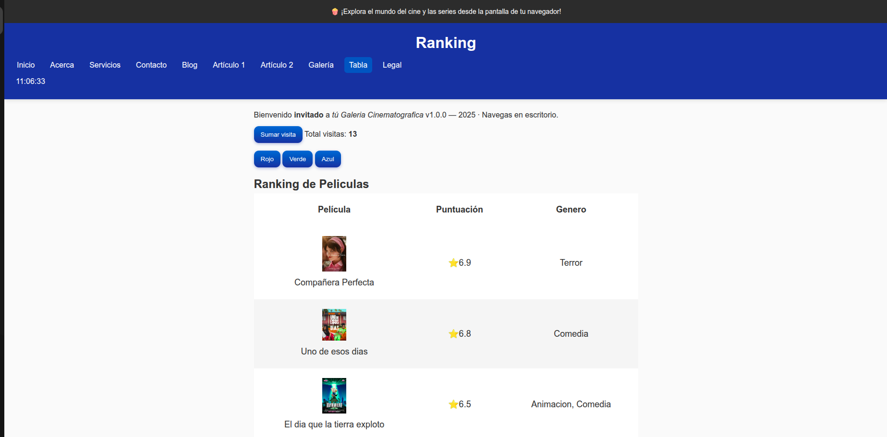
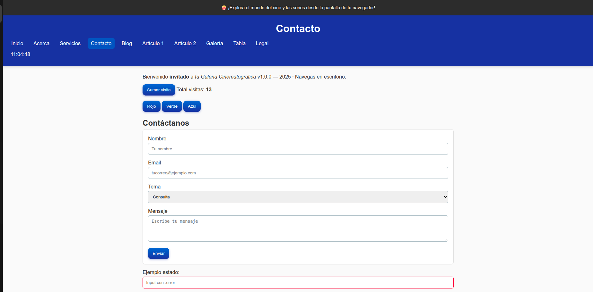

# u4-js-sitio

Sitio web académico desarrollado como parte de la Unidad 4 del curso de JavaScript. El proyecto simula una plataforma temática sobre cine y series, integrando funcionalidades dinámicas con JavaScript, diseño responsivo con CSS, y estructura semántica en HTML.

## Estructura del proyecto

- `/index.html`: Página principal con introducción temática y secciones visuales.
- `/acerca.html`: Perfil dinámico del creador usando template strings.
- `/servicios.html`: Buscador en tiempo real de servicios.
- `/galeria.html`: Galería visual con etiquetas temáticas.
- `/tabla.html`: Tabla comparativa de películas con imágenes.
- `/contacto.html`: Formulario con validación.
- `/legal.html`: Aviso legal y disclaimer académico.
- `/js/app.js`: Archivo principal de JavaScript.
- `/css/styles.css`: Estilos personalizados.

#  Funcionalidades implementadas

- ✅ Mensaje de bienvenida interactivo con `prompt` y `alert`.
- ✅ Contador de visitas con botón y actualización en pantalla.
- ✅ Reloj en tiempo real en el header (`mostrarHora()`).
- ✅ Navegación activa con `data-page` y clase `activo`.
- ✅ Cambio de color con botones (DOM básico).
- ✅ Lista de notas con validación de input (DOM avanzado).
- ✅ Validación de formulario y mensaje de éxito.
- ✅ Buscador en tiempo real por coincidencias.
- ✅ Funciones `sumar()`, `multiplicar()`, `evaluarNumero()`, `obtenerDia()`.
- ✅ Renderizado dinámico del perfil con template strings.
- ✅ Uso de `localStorage` para visitas.
- ✅ Clase `Util` con método `formatearMoneda()`.

## Evidencia visual

### Página principal

### Acerca

### Galería

### Servicios con buscador

### Tabla comparativa

### Contacto

