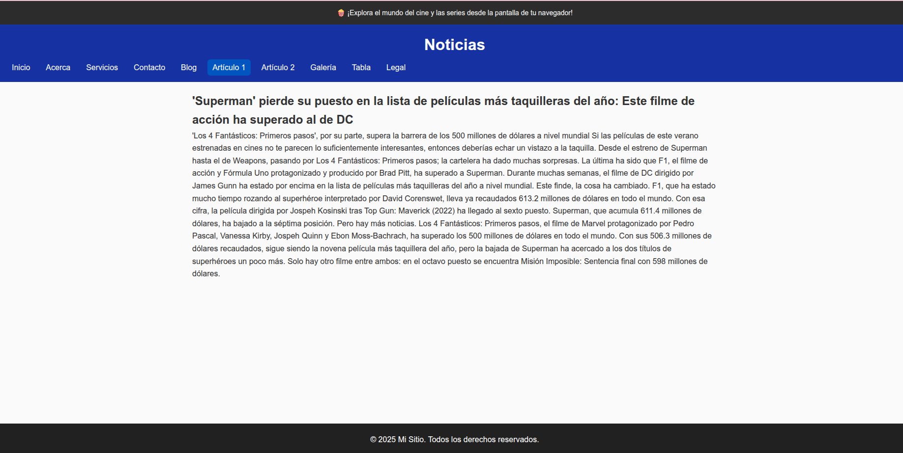
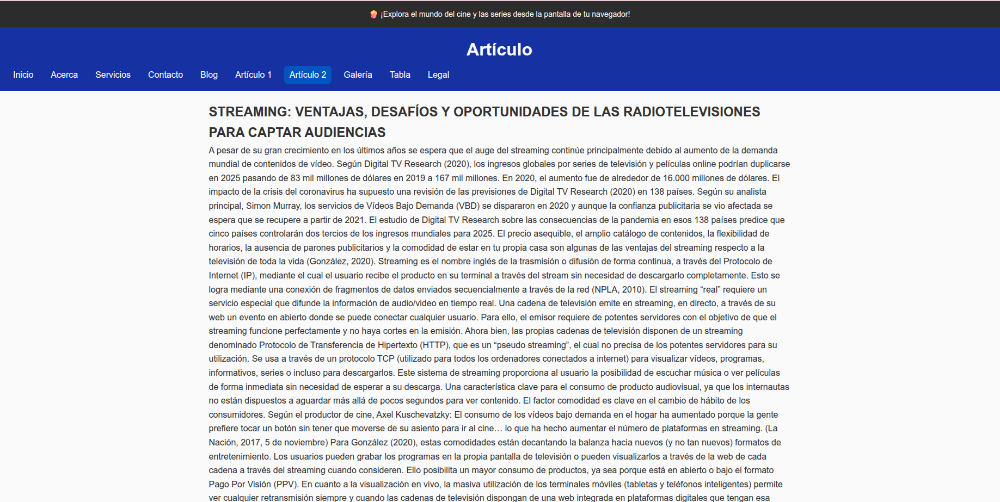
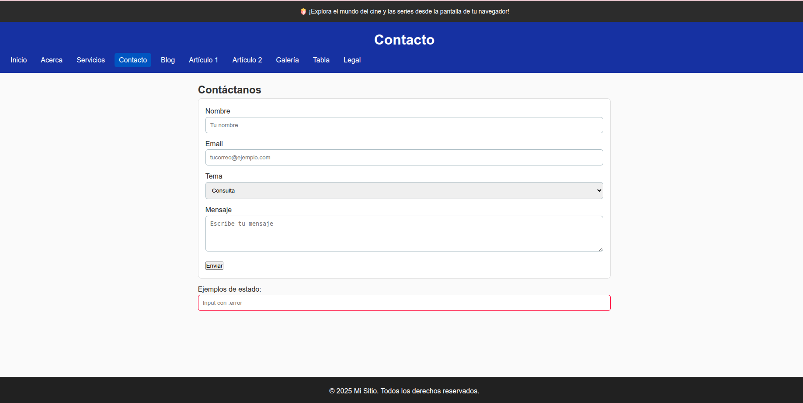
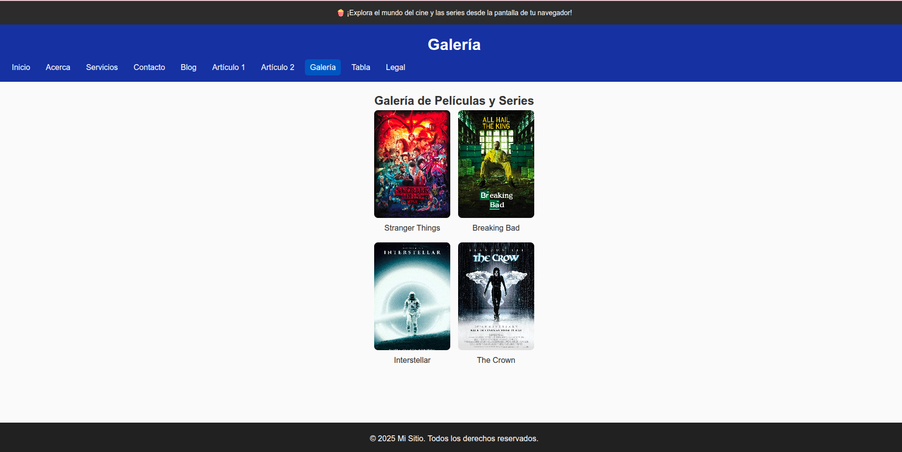
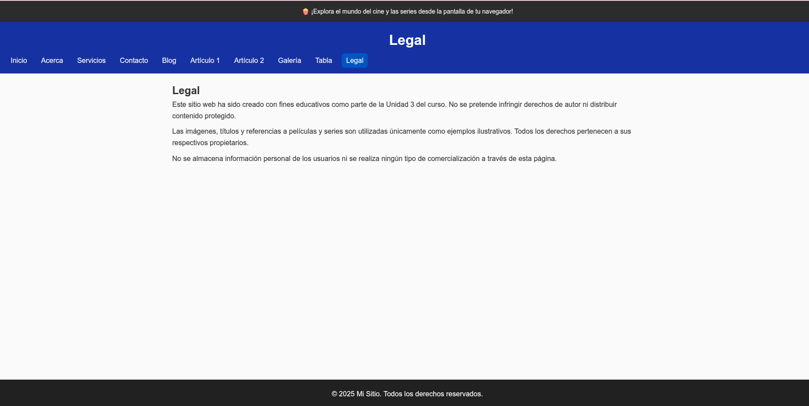
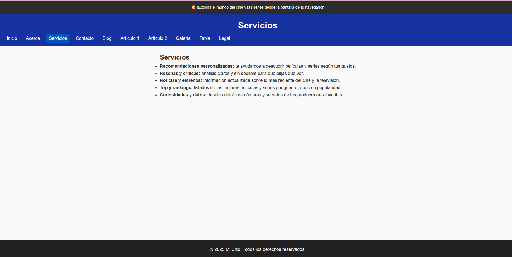
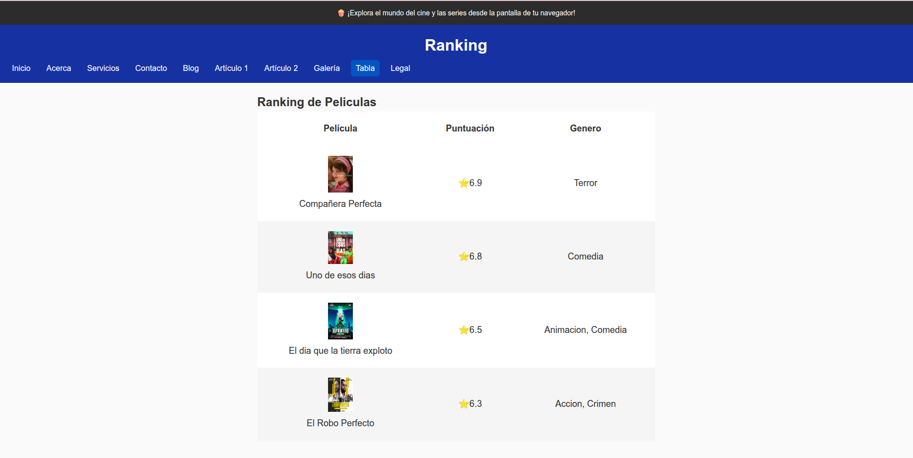

# u3-css3-sitio

Checklist de la Unidad 3 (CSS3 Básico):

- [x] Repositorio (crear en GitHub privado llamado **u3-css3-sitio** y subir estos archivos)
- [x] 10 páginas HTML (index, acerca, servicios, contacto, blog, articulo1, articulo2, galeria, tabla, legal)
- [x] Estructura /css, /img, /media
- [x] `/css/styles.css` enlazado en todas las páginas
- [x] Reset CSS y estilos base
- [x] h1/h2/h3 con tamaños 32/24/20 px
- [x] Header #0D47A1 y texto blanco
- [x] Menú nav con Flexbox
- [x] Clase `.activo` para enlace actual
- [x] `main` con `max-width:1100px` centrado
- [x] `main p` con `margin-bottom:10px`
- [x] Sección `#intro` con fondo y borde
- [x] Grid de 3 columnas `.tarjetas` y tarjetas con hover
- [x] Clases de color `.hex`, `.rgb`, `.hsl`
- [x] Unidades px, %, em, rem
- [x] Tres cajas con margin, padding y border; tercera con `border-box`
- [x] Banner fijo superior en todas las páginas
- [x] Badge absoluto en `blog.html` dentro de contenedor relativo
- [x] Chips en `acerca.html`
- [x] Tabla con filas alternadas en `tabla.html`
- [x] Formulario estilizado en `contacto.html`
- [x] `.error` y `.mensaje-error`
- [x] Galería (8 imágenes) con Grid 4 columnas
- [x] Media queries para responsive
- [x] Estados de foco visibles
- [x] Todas las imágenes llevan `alt`
- [x] Footer #212121 y texto blanco

## 📸 Evidencia visual del proyecto

A continuación se presentan capturas de cada una de las páginas desarrolladas en esta unidad, mostrando la aplicación de estilos CSS3, estructura HTML y elementos visuales requeridos.

  
  
  
  
  
  
  
  
  

## 🧠 Reflexión final

Este proyecto me permitió aplicar conceptos clave de CSS3 como Flexbox, Grid, unidades relativas, pseudoclases y diseño responsive. Además, reforcé buenas prácticas de estructura, accesibilidad y presentación visual. Fue una experiencia enriquecedora que me ayudó a consolidar habilidades técnicas y creativas en el desarrollo web.

